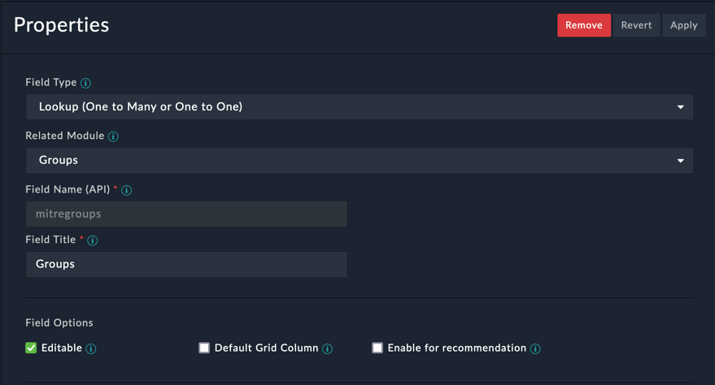
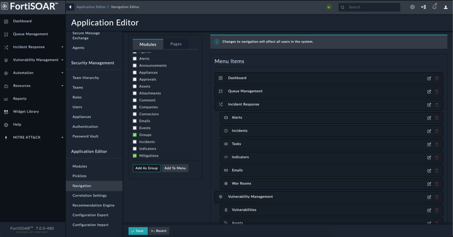
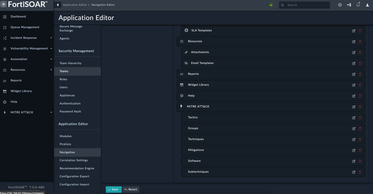

# **MITRE ATT&CK Framework **Solution Pack v2.0.1

## **Overview**

This article describes the FortiSOAR™ MITRE ATT&CK Solution Pack (solution-pack-mitre-attack). This solution pack enables users to use the information and knowledge base that’s provided by the MITRE ATT&CK Framework to its full extent. 

"*MITRE ATT&CK is a globally-accessible knowledge base of adversary tactics and techniques based on real-world observations. The ATT&CK knowledge base is used as a foundation for the development of specific threat models and methodologies in the private sector, in government, and in the cybersecurity product and service community.*"

## **Setting up the MITRE ATT&CK Solution Pack**

You can use the MITRE ATT&CK solution pack to map alerts, incidents, and indicators to MITRE Tactics and Threat Actors; and also hunt for specific tactics in your environment using pre-configured playbooks.
You can setup the MITRE ATT&CK Solution Pack as follows:

1. Deploy the Solution Pack.
2. Review the contents of the MITRE ATT&CK Framework Solution Pack.
3. Setup data ingestion for the MITRE database using the MITRE ATT&amp;CK Connector.
4. Setup modules to lookup MITRE ATT&amp;CK Tactics and Groups.
5. Leverage Hunt Playbooks to look for specific tactics in your environment. Use cases and screenshots from some hunt playbooks are included in the *Use Case Workflow* section.

### **Deploying the MITRE ATT&CK Framework Solution Pack**

**Important**: Before you deploy the solution pack, ensure that you have deployed the FortiSOAR™ Incident Response Solution Pack ([solution-pack-incident-response](https://github.com/fortinet-fortisoar/solution-pack-incident-response)).

The steps for deploying a solution pack are mentioned in the [Deploying a Solution Pack](https://github.com/fortinet-fortisoar/how-tos/blob/main/DeployingASolutionPack.md) article.

## Configuring the MITREATT&CK Solution Pack

Once you have the MITRE ATT&CK Solution Pack deployed, do the following configurations:

1. Setup data ingestion for the MITRE database using the MITRE ATT&CK Connector.
2. Setup modules to lookup MITRE ATT&CK Tactics and Groups. 
3. Leverage Hunt Playbooks to look for specific tactics in your environment. Use cases and screenshots from some hunt playbooks are included in the *Use Case Workflow* topic in this article.

### **Contents of the MITRE ATT&CK Framework Solution Pack**

- Integrations
    - MITRE ATT&CK
    - ElasticSearch
- MITRE ATT&CK Modules
    - Groups
    - Tactics
    - Techniques
    - Sub-techniques
    - Mitigations
    - Software
- MITRE ATT&CK Module View Templates
- MITRE ATT&CK Picklists
    - MITRE ATT&amp;CK Matrices
    - MITRE ATT&CK Software Types
- Roles
    - Updates to the default 'Full App' Permissions Role to include permissions for the new *MITRE* modules
    - New MITRE Admin Role
- Navigation menu that includes MITRE ATT&amp;CK modules
- Hunt Playbook Collections
    - Access Token Manipulation
        - SID-History Injection (T1134.005)
    - Boot or Logon Autostart Execution
        - Winlogon Helper DLL (T1547.004)
    - Credential Access
        - OS Credential Dumping (T1003)
    - Defence Evasion
        - Deobfuscate/Decode Files or Information (T1140)
        - Rogue Domain Controller (T1207)
    - Event Triggered Execution
        - AppInit DLLs (T1546.010)
        - Hidden Files and Directories (T1564.001)
        - Netsh Helper DLL (T1546.007)
        - Screensaver (T1546.002)
    - Process Execution
        - Dynamic Data Exchange (T1559.002)
        - LSASS Driver (T1547.008)
        - XSL Script Processing (T1220)
    - Signed Binary Proxy Execution
        - CMSTP (T1218.003)
        - Compiled HTML File (T1218.001)
        - Control Panel Items (T1218.002)
        - InstallUtil (T1218.004)
        - Mshta (T1218.005)
        - Regsvcs/Regasm (T1218.009)
        - Rundll32 (T1218.011)
    - System Services
        - Service Execution (T1569.002)
- Modulars: These playbooks are used for deduplication and linking of hunt-related records.

### **Setting up Data Ingestion**

The MITRE ATT&CK Connector leverages the ingestion wizard for seamless ingestion of the MITRE ATT&CK Framework on a set schedule and also provide inputs that specify which MITRE ATT&CK matrix should be used for pulling the data. For more information on setting up data ingestion, see the [MITRE ATT&CK](https://docs.fortinet.com/document/fortisoar/2.0.0/mitre-att-ck/149/mitre-att-amp-ck-v2-0-0) connector document that is included in the [FortiSOAR Connectors](https://docs.fortinet.com/fortisoar/connectors) listing page.

**Important**: By default, data ingestion for MITRE is configured with sample data. To get complete MITRE data, please open the connector step from the data ingestion playbook and change the action from "Get MITRE Sample Data" to "Get MITRE Data".

When you install the MITRE ATT&CK Connector using this solution pack a preconfigured ingestion is automatically activated, which schedules a pull for every Sunday midnight UTC. You can rerun the data ingestion wizard to change these preconfigured settings. See the [MITRE ATT&CK](https://docs.fortinet.com/document/fortisoar/2.0.0/mitre-att-ck/149/mitre-att-amp-ck-v2-0-0) connector document on how to set up/reconfigure data ingestion.

### **Setting up modules to lookup MITRE ATT&CK Tactics and Groups**

The MITRE ATT&CK solution pack includes new lookup fields for MITRE ATT&CK Tactics and Groups in the Alerts and Incidents modules, which you can choose to manually update or automatically update during ingestion. If there is a conflict in your environment while exporting the included Alerts and Incidents modules, you can choose to create these lookup fields yourself, by performing the following steps (identical for both modules or for any custom modules):

1. To create MITRE ATT&CK Tactics and Groups for the Alerts module, click **Settings** > **Application Editor** \> **Modules**.
2. On the Modules page, select the **Alerts** module, and click the **Fields Editor** tab. To add the new &#39;Groups&#39; lookup field, click **+** and set its properties as shown in the following screenshot:
   
3. Add the new &#39;Tactics&#39; lookup field, click **+** and set its properties as shown in the following screenshot: 

### **Use Case Workflow**

Hunt playbooks are designed to provide a basic structure and usable examples for conducting MITRE ATT&CK specific threat hunting operations using FortiSOAR.

- All Hunt playbooks have the following workflow pattern:
    - Manual trigger of the hunt playbooks by users that prompts a SIEM choice between Splunk and Elastic.
    - Run a query based on the MITRE Technique details on the selected SIEM.
    - Retrieve query results.
    - Create alerts based on the query results.
    - Add comments on created alerts that describe the workflow resolutions.
    - Deduplicate the comments that create clutter.
- After a hunt playbook is executed, the new alerts are linked to the appropriate MITRE Techniques and/or Sub-techniques.

#### Screenshots of 'Hunt' Playbooks used in user cases

Screenshot of the "Deobfuscate/Decode Files or Information (T1140)" Hunt playbook. This playbook demonstrates the use of Certutil or copy /b to deobfuscate data/files:  

Screenshot of the "Hidden Files and Directories (T1564.001)" Hunt playbook. This playbook hunts for attrib.exe, which is used to hide files.  
 
Screenshot of the "Link ATT&CK technique to Alert" playbook. This playbook links the 'Alert' records that were created as a result of Hunt playbooks to their related MITRE ATT&CK techniques and subtechniques  
 

### **Setting up the Navigation View**

By default, the solution pack does not include the navigation view that contains the new MITRE modules. This is because the navigation view imports overwrite the view altogether. Therefore, after you import the solution pack, you still need to add the new modules to the navigation view. The following screenshots describe this process.

1. Log onto FortiSOAR and click **Settings**. Then in the Application Editor section, click Navigation. This displays the Navigation Editor.  
   
2. On the **Modules** tab, select all the MITRE modules and then click **Add As Group** to add all the modules as part of their own drop-down folder on the left navigation pane:  
    
3. Change the name of the group, add an icon to the folder as per your requirements. You can also change the names of the module pages. MITRE ATT&CK modules appear as follows on the left navigation:  
   
